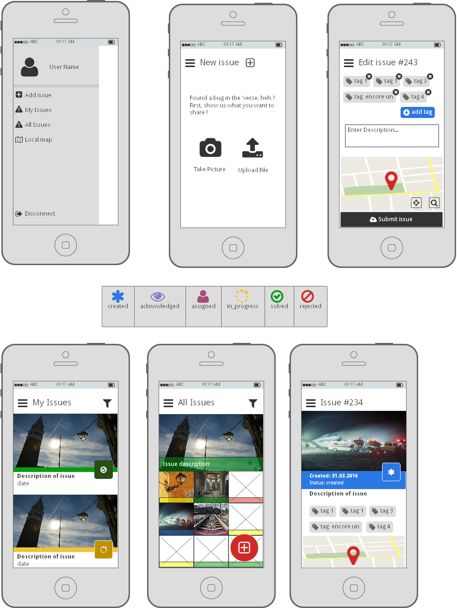
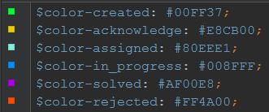
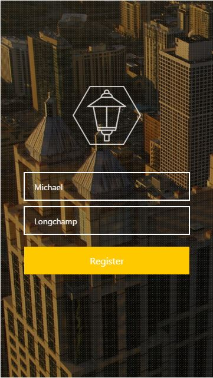
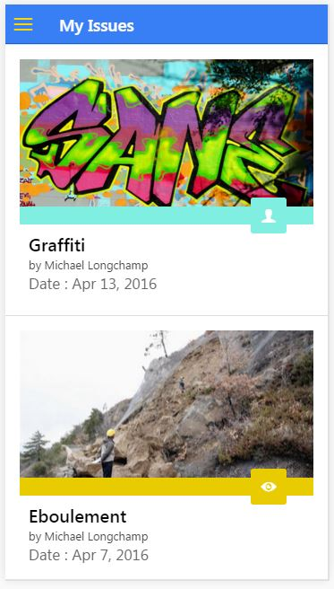

# Citizen Engagement Mobile Application

Ce repository contient notre application Citizen Engagement. 
Cette documentation permet de prendre en main l'application.

1. [Installation](#installation)
2. [Mockup](#mockup)
2. [Login](#login)
3. [Menu](#menu)
4. [My issues](#myIssues)
5. [Issue Map](#issueMap)
6. [All issues](#allIssues)
7. [New Issue](#newIssue)
8. [Issue Details](#issueDetails)

## 1. Installation

Tout d'abord, il faut télécharger le contenu de ce repository. Afin de lancer l'application, il faut se positionner dans le répertoire Teaching-HEIGVD-CM_APPMOB-2016-CitizenEngagement téléchargé et lancer la commande suivante : 

    ionic serve

<a href="#top">Back to top</a>

## 2. Mockups
Voici les mockups que nous avons réalisés avant le développement : 

Les différentes couleurs correspondent à un code couleur que nous avons imaginé selon le status de l'issue : 

A noter que l'icon s'adapte également en fonction du status (légende des icons au centre des mockups).

<a href="#top">Back to top</a>

## 3. Login
A ce moment-là, nous arrivons sur une page de login. N'importe quel login est accepté. Il suffit de rentrer son prénom et son nom. Pour une première démonstration, vous pouvez utiliser les identifiants suivants : 

First Name : Michael

Last Name : Longchamp

Puis cliquez sur "Register"

<a href="#top">Back to top</a>

## 4. Menu
Une fois logué, vous arrivez directement sur la liste de toutes les issues (All issues).
En haut à gauche se trouve un bouton pour accéder au menu. 
Le menu de notre application se décompose en quatres onglets : 

1. My issue
2. Issue Map
3. All issues
4. New issue

En bas du menu, on trouve un bouton pour de déloguer.

img menu

<a href="#top">Back to top</a>

## 5. My issues
En cliquant sur "My issues" dans le menu, on trouve toutes les issues recensées par l'utilisateur connecté en ce moment. Si vous avez créer un nouvel utilisateur, cette page est vide. Si vous ajoutez des issues, vous pourrez les retrouver ici. En cliquant sur une issue, on accède à la page de détail de celle-ci.

<a href="#top">Back to top</a>

## 6. Issue Map
En cliquant sur "Issue Map" dans le menu, on trouve une carte affichant toutes les issues référencées dans l'application. En cliquant sur un icon d'issue, on accède à des détails sur celle-ci.

img issue map

<a href="#top">Back to top</a>

## 7. All issues
En cliquant sur "All issues" dans le menu, on trouve une page avec toutes les issues référencées dans l'application. En cliquant sur une issue, on accède à une page de détails sur celle-ci.

img all issues

<a href="#top">Back to top</a>

## 8. New issue
En cliquant sur "New issue" dans le menu, on accède à une page permettant de prendre une photo du problème concerné. Une fois la photo prise, nous pouvons choisir de continuer ou d'annuler. 

Si l'on annule, on revient à la page précédente. 
Si l'on accepte, on passe à l'étape suivante qui est de remplir les détails sur le problème en question. Il s'agit ici de référencer un type grâce à une liste déroulante, une description, et d'indiquer la longitude et la latitude du problème grâce à la carte. Il suffit de déplacer la carte et de centrer l'objectif sur le lieu voulu pour que les valeurs se mettent à jour. Une fois OK, on clique sur "Create Issue".

img new issue

<a href="#top">Back to top</a>

## 9. Issue Détails
Le détail d'une issue s'affiche lorsqu'on clique sur une issue (dans "My issues" ou "All issues"). Ce détail permet de consulter la date, le status, la description, les tags lié à l'issue et sa position. Un bouton permet également d'ajouter des tags à une issue.

img issue détails

<a href="#top">Back to top</a>

