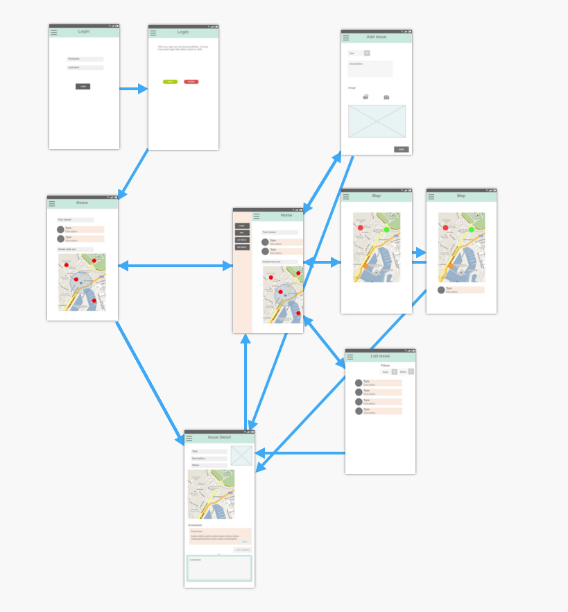

# CTHeroes mobile application

This repository contains the code to launch the ionic application.

* [Prerequisites](#pre)
* [Features](#features)

1. [user interface](#ui)
2. [Using the application](#using)
  * [Home dashboard](#setup-fork)
  * [Create new Issue]
  *

## Prerequisites

These instructions assume that you have implemented and deployed the Citizen Engagement API as described in [this article](http://www.iflux.io/use-case/2015/02/03/citizen-engagement.html) and [this course repository](https://github.com/SoftEng-HEIGVD/Teaching-HEIGVD-CM_WEBS-2016).

You will need to have [Node.js](https://nodejs.org) installed.
The latest LTS (Long Term Support) version is recommended (v4.4.2 at the time of writing these instructions).
The Ionic documentation currently indicates that versions v5.x.x are not supported.

<a href="#top">Back to top</a>

## Features

This guide describes the list of features of this app:

* add new issues:
  * with a type, image, description and lat/long geolocation
* see existing issues on an interactive map;
* a dashboard with a small map and the latest posted issues by the user (if no issues have been posted, you have a quick link to report one)
* browse the list of existing issues:
  * sorted by date
* see the details of an issue:
  * date;
  * description;
  * picture;
  * comments;
* add comments to an issue.

We will give you details on how to use each feature
<a href="#top">Back to top</a>

## 1. User Interface

We have created a design for our app available [here](https://www.fluidui.com/editor/live/preview/p_JGHaMwhypEvFRJXSJF2ELBFvhTuCJ7iW.1459774779362)
with [Fluid UI](https://www.fluidui.com).

We have created a sandwich menu with different pannels (some changes have been made in the final app)

* the home tab
* the new issue tab;
* the issue map tab;
* the issue list tab:
  * the issue details screen doesn't appear on the side menu but when you click on a thumbnail

<a href="#top">Back to top</a>

## 2. Using the application

### Login

You can enter your first and last name. If you do not exist in the database, this will create a new account.
You then have to select if you want to view the app as a citizen or staff (this feature will come soon).

You can also create a new staff if you're a staff yourself (coming soon as well).

### Side menu

### Home dashboard
The home dashboard allows you to see your latest posted issues at a glance and the nearest issues to you.

You can see all your posted issues

If you do not have any issues, you will have a quick link to post a new one

### Report new Issue

<a href="#top">Back to top</a>
