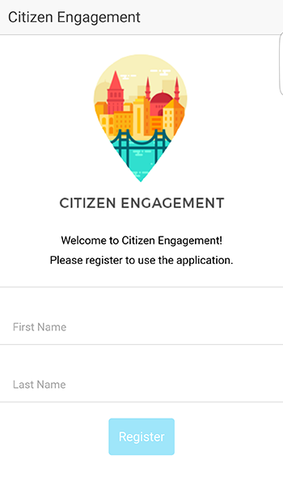

# Citizen Engagement Mobile Application

Cette application a été développée dans le cadre du cours de 3ème année Application Mobile de la HEIG-VD.

L'application Citizen Engagement permet à n'importe qui dans sa ville de signaler des éléments dangereux afin qu'ils soient réparés ! C'est une application qui permet l'engagement citoyen afin d'améliorer la vie dans la ville.

## Inscription

L'application requiert une inscription afin que vous puissez l'utiliser. Il suffit d'inscrire votre nom et prénom, qui seront ensuite utilisés lorsque que vous posterez des incidents.

## Menu
Le menu se trouve sur la gauche en appuyant sur le bouton en haut à gauche. Il permet plusieurs actions qui seront expliquée ci-dessous.

## Liste des incidents

Cet onglet permet d'afficher tous les incidents reportés par les utilisateurs. Vous pouvez voir un aperçu de leurs informations. Vous pouvez aussi les trier soit par type, date ou voir seulement vos incidents que vous avez déjà reporté. Si vous cliquez sur un, vous pourrez accéder aux détails de l'incident.

## Détails d'un incident

Cette page permet de connaître toutes les informations sur l'incident choisi. Vous pouvez aussi cliquer sur le petit pin de géolocalisation qui vous permettra d'afficher la carte avec le lieu de l'incident. Vous pouvez aussi poster un commentaire ou lire simplement ceux qui sont déjà postés.

## Carte des incidents

Cette carte permet, en récupérant votre géolocalisation, afficher tous les incidents aux alentours de vous !

## Créer un incident

Pour créer un incident, il suffit de remplir ce formulaire, en prenant un photo, en indiquant le type d'incident et une description. L'application gérera toute seule la géolocalisation et la date de création ! Vous pourrez ensuite retrouver votre incident dans la liste.

## Se déconnecter

Vous pouvez vous déconnecter de l'application en cliquant dans l'onglet prévu.
